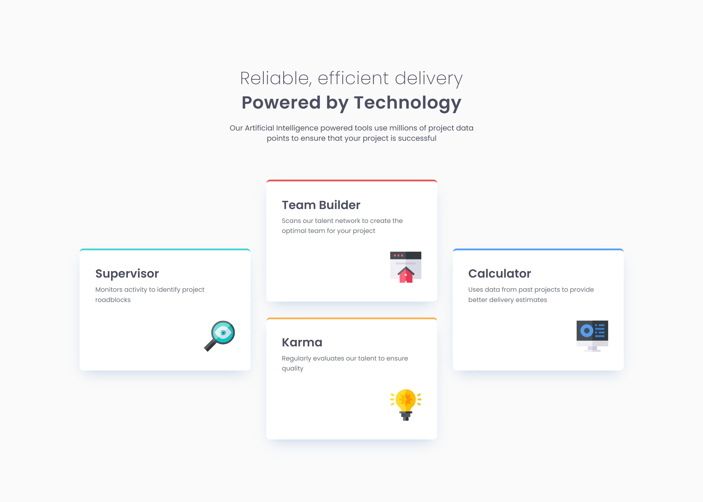

# Frontend Mentor - Four card feature section solution

This is a solution to the [Four card feature section challenge on Frontend Mentor](https://www.frontendmentor.io/challenges/four-card-feature-section-weK1eFYK). Frontend Mentor challenges help you improve your coding skills by building realistic projects. 

## Table of contents

- [Overview](#overview)
  - [The challenge](#the-challenge)
  - [Screenshot](#screenshot)
  - [Links](#links)
- [My process](#my-process)
  - [Built with](#built-with)
  - [What I learned](#what-i-learned)
  - [Continued development](#continued-development)
- [Author](#author)

## Overview

### The challenge

Users should be able to:

- View the optimal layout for the site depending on their device's screen size

### Screenshot

### Links

- Solution URL: [GitHub](https://github.com/stefanteichert/Four-Card-Feature-Section-Frontendmentor)
- Live Site URL: [Vercel](https://four-card-feature-section-frontendm.vercel.app/)

## My process

### Built with

- Semantic HTML5 
- CSS custom properties
- Flexbox
- CSS Grid
- Mobile-first workflow
- Figma Desktop App
- VS Code

### What I learned

The biggest highlight of this project was mastering **CSS Grid** to create the layout. Instead of using multiple wrapper divs or flexbox hacks, I implemented a more mathematical approach by using a refined grid system.

### Continued development

- **Mobile-First Workflow:** Although I managed the responsiveness in this project, I want to become more consistent in using a strictly mobile-first approach.
- **CSS Grid Mastery:** I really enjoyed the logic behind the grid system in this challenge. I want to explore more advanced Grid features like `grid-template-areas` and the `subgrid` property to handle even more complex layouts with less code.

## Author

- Frontend Mentor - [@Stefan](https://www.frontendmentor.io/profile/stefanteichert)
